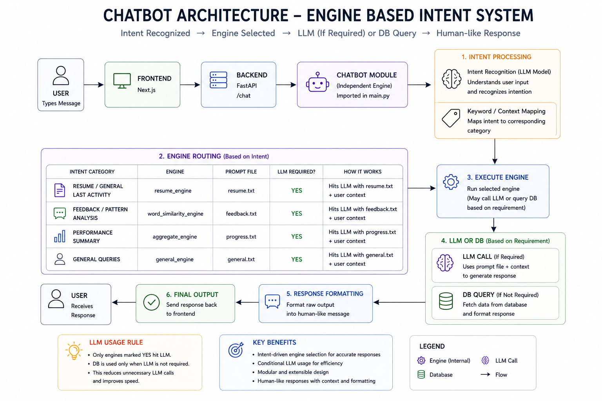
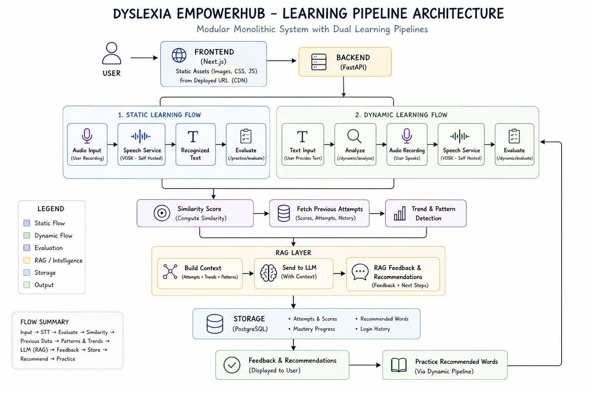
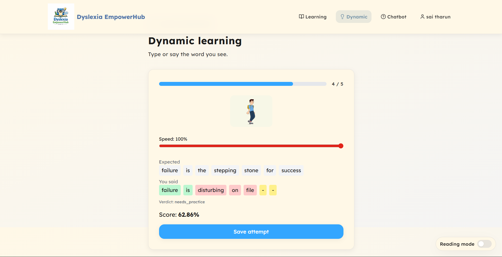
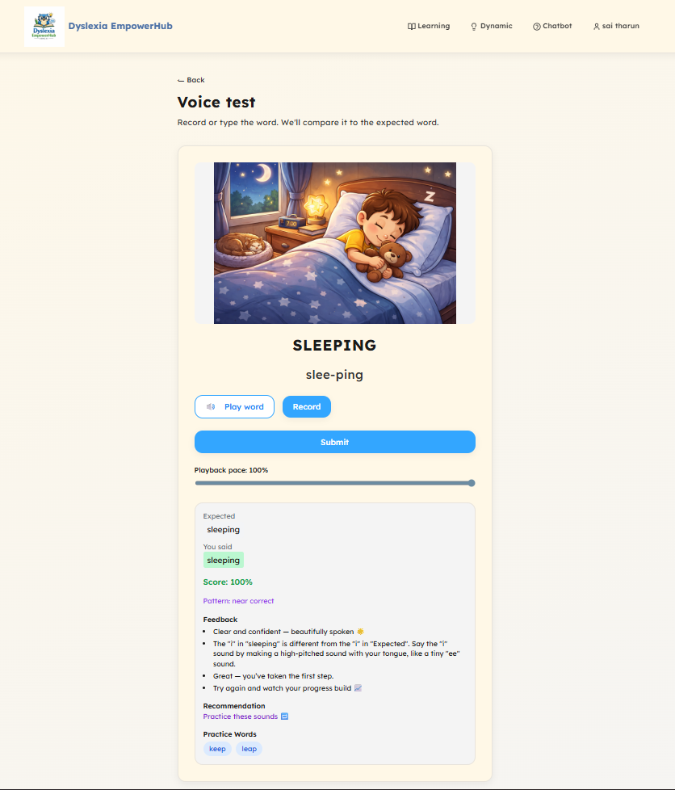

# 🧠 Dyslexia EmpowerHub

A modular, pipeline-driven learning platform designed to improve pronunciation, confidence, and speech clarity through structured evaluation and intelligent feedback.

---

## 🎯 Overview

Dyslexia EmpowerHub is built as a **Modular Monolithic System** that focuses on **architecture, data flow, and intelligent feedback pipelines** rather than just features.

The system processes user input (speech/text) through multiple engines to generate **context-aware feedback and recommendations**.

---

## 🏗️ Architecture

This system is designed as a **modular monolith** with two major subsystems:

- Learning Pipeline (Speech + Evaluation + RAG)
- Engine-Based Chatbot (Intent → Engine Routing)

---

### 🔹 Learning Pipeline Architecture

---

### 🔹 Chatbot Architecture (Engine-Based)

---

## 🔄 Learning Pipeline Flow

Two flows exist inside a single pipeline:

### 1. Static Learning Flow

Audio → Speech Service → Recognized Text → Evaluate → Similarity Score

---

### 2. Dynamic Learning Flow

Text → Analyze → Audio → Speech → Evaluate → Similarity Score

---

### 🧠 RAG Layer (Core Intelligence)

After evaluation:

Fetch Previous Attempts + Scores + History  
↓  
Pattern Detection  
↓  
Trend Analysis  
↓  
Context Builder  
↓  
LLM → Feedback + Recommendation  

---

### 🗄️ Storage

Tracks:

- Attempts  
- Scores  
- Mastery Progress  
- Login History  
- Recommended Words  

---

## 🤖 Chatbot System (Engine-Based)

The chatbot is an **independent module** integrated into the backend.

### Flow

User Input → Intent Detection → Engine Routing → Execute Engine → Response  

---

### 🧠 Engine Design

Each intent maps to a specific engine.

#### 🔹 LLM-Based Engines

| Intent | Engine | Prompt |
|--------|--------|--------|
| Resume / Last Activity | resume_engine | resume.txt |
| Feedback Analysis | word_similarity_engine | feedback.txt |
| Performance Summary | aggregate_engine | progress.txt |
| General Queries | general_engine | general.txt |

These follow:

Prompt + Context → LLM → Response

---

#### 🔹 Non-LLM Engines

- Fetch data directly from DB  
- Format structured responses  

This reduces:

- unnecessary LLM calls  
- latency  
- cost  

---

### ⚡ Key Idea

> Not every query hits the LLM.  
> Only **intelligent queries** use it.

---

## 🔁 End-to-End Flow

Input → STT → Evaluate → Similarity → RAG → LLM → Feedback → Store → Recommend  

---

## 🚀 Features

- Real-time speech evaluation  
- Dual learning pipelines (static + dynamic)  
- RAG-based feedback and recommendation  
- Engine-based chatbot with intent routing  
- Conditional LLM usage (optimized)  
- Self-hosted speech recognition (VOSK)  
- Attempt tracking and progress analysis  

---

## 🧠 Core Concepts Used

- Modular Monolith Architecture  
- Pipeline-Based Processing  
- Intent Detection  
- Similarity Algorithms  
- Alignment Logic  
- RAG (Retrieval-Augmented Generation)  
- Conditional LLM Invocation  

---

## 🏗️ Tech Stack

### Backend
- FastAPI  
- SQLAlchemy  
- PostgreSQL  

### Frontend
- Next.js  

### AI / Processing
- HuggingFace (Self-hosted STT - VOSK)  
- OpenRouter (LLM)  

### Infrastructure
- Docker  
- Render (Backend + Speech Service)  
- Vercel (Frontend)  

---

## ⚠️ Challenges Faced

- CORS issues during frontend-backend integration  
- Environment variable separation (frontend vs backend)  
- Speech service cold starts (Render free tier)  
- Audio processing and noise handling  
- Inter-service communication failures  

---

## 👨‍💻 My Contribution

- Backend architecture design  
- AI/RAG pipeline implementation  
- Chatbot engine system  
- Database design and integration  
- Service orchestration  

---

## 📷 Screenshots

### 🔹 Dynamic Learning (AI Evaluation)

---

### 🔹 Voice Practice & Feedback

---

## 🔗 Links

- Live App: https://dyslexia-empowerhub.vercel.app 
- Backend API: (add)  
- Speech Service: (add)  
- Demo Video: (optional)  

---

## 🚀 Future Improvements

- Move to microservices architecture  
- Real-time streaming speech evaluation  
- Embedding-based RAG (vector DB)  
- Personalized adaptive learning  

---

## 🧠 Final Thought

This project focuses on:

> **How systems are designed, not just what they do**
